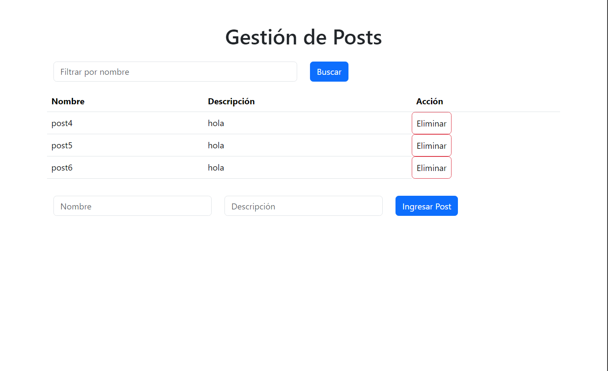

# Prueba tecnica TCIT

Realizar una pequeña aplicación de Post creando el frontEnd con React y Redux y el backEnd con node.js y express.

## Requisitos Previos

Antes de comenzar, asegúrate de tener instalado lo siguiente:  - Node.js y npm - PostgreSQL

## Configuración del Backend

### Instalación de Dependencias

1. Abre una terminal y navega hasta la carpeta del backend:      cd back-end
2. Instala las dependencias necesarias:  npm install
3. Realiza la configuración de la base de datos y ejecuta el servidor: node index.js

## Configuración del Frontend

### Instalación de Dependencias

1. Abre una terminal y navega hasta la carpeta del backend:      cd front-end
2. Instala las dependencias necesarias:  npm install
3. Inicia la aplicación: npm start

## Página

### Aplicación creada con react y redux y node.js con express

## Autor

### Matías Jaque Montecinos

